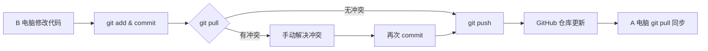

# Git操作

1.远端仓库默认最新，本地电脑端进行修改之前，需要先git pull同步到远程最新的


### 场景1
```txt 
昨天我在A电脑的LLM_code目录写了一些代码，并上传到github的同名仓库。今天我在B电脑pull下来LLM_code，添加一些代码。如何上传到github进行同步。
```
这是一个非常标准的 **Git 协作流程**。既然你在 B 电脑上已经 `pull` 过代码并进行了修改，现在的目标是将 B 电脑的新更改 **提交（Commit）** 并 **推送（Push）** 到 GitHub，以便 A 电脑和其他设备能同步到最新代码。

请在 **B 电脑** 的终端（Terminal 或 Git Bash）中，进入 `LLM_code` 目录，按以下步骤操作：

### 第一步：检查状态与配置
在操作前，先确认当前状态和 Git 身份（因为是新电脑，可能没配置过用户信息）。

```bash
# 1. 进入项目目录
cd /path/to/LLM_code

# 2. 查看哪些文件被修改了
git status
```
*   **观察输出**：你会看到红色字体的文件（未暂存）或绿色字体的文件（已暂存）。
*   **配置身份（如果是 B 电脑第一次用 Git）**：
    GitHub 需要知道是谁提交的代码。如果提示 `please tell me who you are`，请运行：
    ```bash
    git config --global user.name "你的名字"
    git config --global user.email "你的邮箱@github.com"
    ```

### 第二步：暂存与提交 (Add & Commit)
将你在 B 电脑上新写或修改的代码保存到本地仓库。

```bash
# 1. 将所有修改添加到暂存区
git add .

# 2. 提交更改到本地仓库，-m 后面是提交信息（建议写清楚改了啥）
git commit -m "feat: 在 B 电脑添加了新功能模块"
```
*   **注意**：如果 `git status` 显示 `nothing to commit`，说明没有新改动，跳过此步。

### 第三步：同步远程代码 (Pull) —— **关键步骤**
在推送之前，**务必先拉取** GitHub 上的最新代码。
*   **原因**：万一昨天 A 电脑在你之后又上传了新代码，直接推送会失败（冲突）。先 `pull` 可以把 A 的代码合并到你本地。

```bash
# 拉取远程仓库的最新代码并合并
git pull origin main
```
*   **注意分支名**：如果你的主分支叫 `master` 而不是 `main`，请将命令改为 `git pull origin master`。可以用 `git branch` 查看当前分支。
*   **如果有冲突**：终端会提示 `CONFLICT`。你需要手动打开冲突文件，解决冲突后，再次 `git add` 和 `git commit`。

### 第四步：推送到 GitHub (Push)
将本地提交好的代码上传到 GitHub 服务器。

```bash
# 推送到远程仓库
git push origin main
```
*   **身份验证**：
    *   如果是 **HTTPS** 链接：GitHub 现在不支持直接用账号密码，需要输入 **Personal Access Token (PAT)** 作为密码，或者配置了 SSH Key。
    *   如果是 **SSH** 链接：确保 B 电脑已经添加了 SSH Key 到 GitHub 账户。

### 第五步：验证同步
1.  打开 GitHub 网页，刷新 `LLM_code` 仓库页面。
2.  查看 **Commits** 记录，确认刚才的提交信息（"feat: 在 B 电脑..."）出现在列表中。
3.  回到 **A 电脑**，在 `LLM_code` 目录下运行 `git pull`，即可同步到 B 电脑写的代码。

---

### 💡 常见问题与解决方案

| 问题现象 | 原因 | 解决方案 |
| :--- | :--- | :--- |
| `Permission denied (publickey)` | SSH Key 未配置 | 在 B 电脑生成 SSH Key (`ssh-keygen`) 并添加到 GitHub 设置中。 |
| `Authentication failed` | HTTPS 密码错误 | 使用 GitHub 生成的 **Token** 代替密码，或改用 SSH 链接。 |
| `rejected ... fetch first` | 远程有更新 | 先运行 `git pull` 合并代码，再 `git push`。 |
| `CONFLICT (content): Merge conflict` | 代码冲突 | A 和 B 修改了同一文件的同一行。需手动编辑文件保留需要的内容，然后 `add` -> `commit` -> `push`。 |

### 总结流程图


按照上述步骤操作，即可安全地完成代码同步。